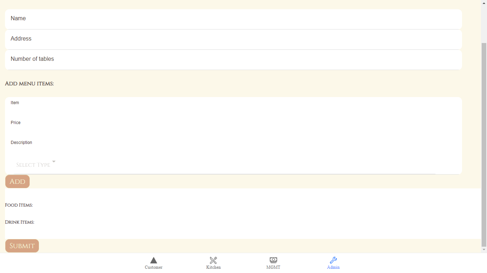

<h3 align="center"></h3>

<h3 align="left">An app made to connect restaurants and customers in these uncertain times. This app allows you to access a restaurant's menu and place an order just by scanning QR-code! </h3>

<h3 align="left">For restaurant managers, Ocras allows you to quickly upload a menu, generate QR codes for your restaurant and easily track the resulting orders!</h3>

<h2>Installation:</h2>

To run app locally, clone the repo and run from frontend folder.
> npm install

Then...

>ionic build

...from the 'frontend' directory.

<h2>  Quick Demo </h2>

To quickly see what our app is about, you can use a QR code scanner to scan the code below and this will take you to the Customer Ordering page. 

From here, you can place an order into the system, then follow the order on the Kitchen and MGMT pages. 

<h2 align="left"> </h2> 

<h2>  Full Demo </h2>

For a more complete demo, follow this link to be taken to the Admin screen of our app.

<a href="https://p-angular-cb7fc.web.app/tabs/tab4">Enter your menu into Ocras</a>

From here , a user can input their restaurant details, menu options and the number of tables in their restaurant. 
<h2 align="center"> </h2> 

Once all the details are entered, the app will generate a QR code for each table in the restaurant. Each scanned QR code will take the scanner to the restaurant's Customer Page where an order can be placed.  
<h2 align="center"> </h2> 

After placing an order, you can then move to the Kitchen screen to see a list of orders yet to be served. Click the 'Served' button to process the order as served. This action will remove the order from the Kitchen view. You can follow the order in the MGMT section.
<h2 align="center"> </h2> 

Similar to the Kitchen screen, the MGMT screen displays unpaid orders. These can be processed as paid by clicking the 'Paid' button. Again, this action will remove the order from the MGMT screen. 
<h2 align="center"> </h2> 

<h2>Enjoy!</h2>

